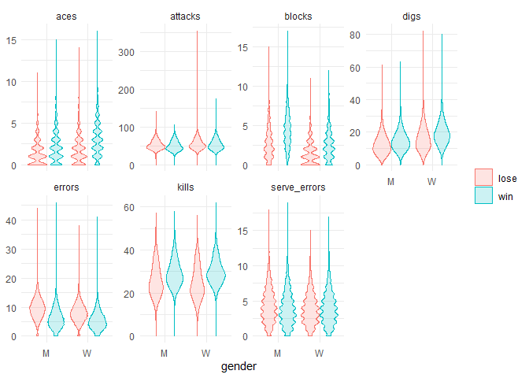
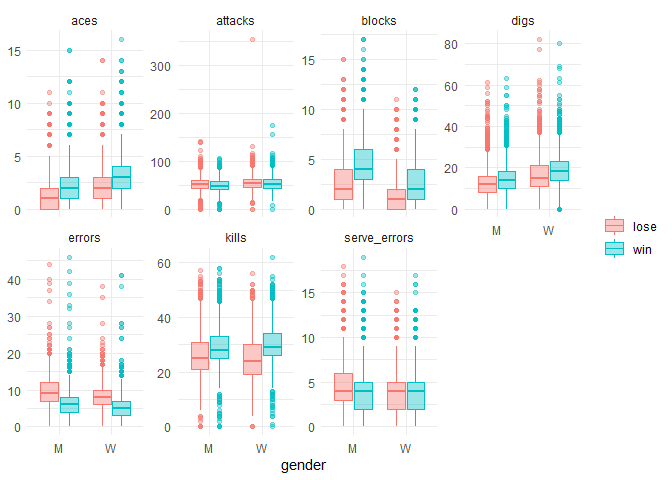
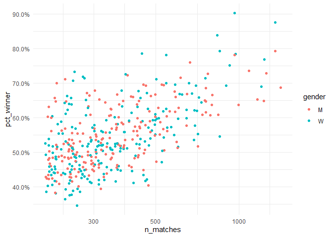

EDA
================
Tu
2020/5/24

``` r
#skimr::skim(vb_matches)
```

``` r
head(vb_matches)
```

    ## # A tibble: 6 x 65
    ##   circuit tournament country  year date       gender match_num w_player1
    ##   <chr>   <chr>      <chr>   <dbl> <date>     <chr>      <dbl> <chr>    
    ## 1 AVP     Huntingto~ United~  2002 2002-05-24 M              1 Kevin Wo~
    ## 2 AVP     Huntingto~ United~  2002 2002-05-24 M              2 Brad Tor~
    ## 3 AVP     Huntingto~ United~  2002 2002-05-24 M              3 Eduardo ~
    ## 4 AVP     Huntingto~ United~  2002 2002-05-24 M              4 Brent Do~
    ## 5 AVP     Huntingto~ United~  2002 2002-05-24 M              5 Albert H~
    ## 6 AVP     Huntingto~ United~  2002 2002-05-24 M              6 Jason Ri~
    ## # ... with 57 more variables: w_p1_birthdate <date>, w_p1_age <dbl>,
    ## #   w_p1_hgt <dbl>, w_p1_country <chr>, w_player2 <chr>, w_p2_birthdate <date>,
    ## #   w_p2_age <dbl>, w_p2_hgt <dbl>, w_p2_country <chr>, w_rank <chr>,
    ## #   l_player1 <chr>, l_p1_birthdate <date>, l_p1_age <dbl>, l_p1_hgt <dbl>,
    ## #   l_p1_country <chr>, l_player2 <chr>, l_p2_birthdate <date>, l_p2_age <dbl>,
    ## #   l_p2_hgt <dbl>, l_p2_country <chr>, l_rank <chr>, score <chr>,
    ## #   duration <time>, bracket <chr>, round <chr>, w_p1_tot_attacks <dbl>,
    ## #   w_p1_tot_kills <dbl>, w_p1_tot_errors <dbl>, w_p1_tot_hitpct <dbl>,
    ## #   w_p1_tot_aces <dbl>, w_p1_tot_serve_errors <dbl>, w_p1_tot_blocks <dbl>,
    ## #   w_p1_tot_digs <dbl>, w_p2_tot_attacks <dbl>, w_p2_tot_kills <dbl>,
    ## #   w_p2_tot_errors <dbl>, w_p2_tot_hitpct <dbl>, w_p2_tot_aces <dbl>,
    ## #   w_p2_tot_serve_errors <dbl>, w_p2_tot_blocks <dbl>, w_p2_tot_digs <dbl>,
    ## #   l_p1_tot_attacks <dbl>, l_p1_tot_kills <dbl>, l_p1_tot_errors <dbl>,
    ## #   l_p1_tot_hitpct <dbl>, l_p1_tot_aces <dbl>, l_p1_tot_serve_errors <dbl>,
    ## #   l_p1_tot_blocks <dbl>, l_p1_tot_digs <dbl>, l_p2_tot_attacks <dbl>,
    ## #   l_p2_tot_kills <dbl>, l_p2_tot_errors <dbl>, l_p2_tot_hitpct <dbl>,
    ## #   l_p2_tot_aces <dbl>, l_p2_tot_serve_errors <dbl>, l_p2_tot_blocks <dbl>,
    ## #   l_p2_tot_digs <dbl>

``` r
vb_parsed <- vb_matches %>%
  transmute(
    circuit,
    gender,
    year,
    w_attacks = w_p1_tot_attacks + w_p2_tot_attacks,
    w_kills = w_p1_tot_kills + w_p2_tot_kills,
    w_errors = w_p1_tot_errors + w_p2_tot_errors,
    w_aces = w_p1_tot_aces + w_p2_tot_aces,
    w_serve_errors = w_p1_tot_serve_errors + w_p2_tot_serve_errors,
    w_blocks = w_p1_tot_blocks + w_p2_tot_blocks,
    w_digs = w_p1_tot_digs + w_p2_tot_digs,
    l_attacks = l_p1_tot_attacks + l_p2_tot_attacks,
    l_kills = l_p1_tot_kills + l_p2_tot_kills,
    l_errors = l_p1_tot_errors + l_p2_tot_errors,
    l_aces = l_p1_tot_aces + l_p2_tot_aces,
    l_serve_errors = l_p1_tot_serve_errors + l_p2_tot_serve_errors,
    l_blocks = l_p1_tot_blocks + l_p2_tot_blocks,
    l_digs = l_p1_tot_digs + l_p2_tot_digs
  ) %>%
  na.omit()
```

``` r
winners <- vb_parsed %>%
  select(circuit, gender, year,
         w_attacks:w_digs) %>%
  rename_with(~ str_remove_all(., "w_"), w_attacks:w_digs) %>%
# . means piping in all columns
  mutate(win = 'win')

losers <- vb_parsed %>%
  select(circuit, gender, year,
         l_attacks:l_digs) %>%
  rename_with(~ str_remove_all(., "l_"), l_attacks:l_digs) %>%
  mutate(win = "lose")

vb_df <- bind_rows(winners, losers) %>%
  mutate_if(is.character, factor) # change anything that is character to factor
```

``` r
vb_df %>%
  pivot_longer(attacks:digs, names_to = 'stat', values_to = 'value') %>%
  # pivot_longer would make things easier to plot
  ggplot(aes(gender, value, fill = win, color = win))+
  geom_violin(alpha = 0.2)+
  # a = 0.4, othersie you cant see the median from the graph
  facet_wrap(~stat, scales = 'free_y', nrow = 2) +
     # free_y because the value vary
  labs(y = NULL, color = NULL, fill = NULL)
```

<!-- -->

``` r
  # y = null becasue of 
```

``` r
vb_df %>%
  pivot_longer(attacks:digs, names_to = "stat", values_to = "value") %>%
  ggplot(aes(gender, value, fill = win, color = win)) +
  geom_boxplot(alpha = 0.4) +
  facet_wrap(~stat, scales = "free_y", nrow = 2) +
  labs(y = NULL, color = NULL, fill = NULL)
```

<!-- -->

Generally, it looks like digs, blocks, aces and less errors result in
victory.

## Keep exploring

``` r
head(vb_matches)
```

    ## # A tibble: 6 x 65
    ##   circuit tournament country  year date       gender match_num w_player1
    ##   <chr>   <chr>      <chr>   <dbl> <date>     <chr>      <dbl> <chr>    
    ## 1 AVP     Huntingto~ United~  2002 2002-05-24 M              1 Kevin Wo~
    ## 2 AVP     Huntingto~ United~  2002 2002-05-24 M              2 Brad Tor~
    ## 3 AVP     Huntingto~ United~  2002 2002-05-24 M              3 Eduardo ~
    ## 4 AVP     Huntingto~ United~  2002 2002-05-24 M              4 Brent Do~
    ## 5 AVP     Huntingto~ United~  2002 2002-05-24 M              5 Albert H~
    ## 6 AVP     Huntingto~ United~  2002 2002-05-24 M              6 Jason Ri~
    ## # ... with 57 more variables: w_p1_birthdate <date>, w_p1_age <dbl>,
    ## #   w_p1_hgt <dbl>, w_p1_country <chr>, w_player2 <chr>, w_p2_birthdate <date>,
    ## #   w_p2_age <dbl>, w_p2_hgt <dbl>, w_p2_country <chr>, w_rank <chr>,
    ## #   l_player1 <chr>, l_p1_birthdate <date>, l_p1_age <dbl>, l_p1_hgt <dbl>,
    ## #   l_p1_country <chr>, l_player2 <chr>, l_p2_birthdate <date>, l_p2_age <dbl>,
    ## #   l_p2_hgt <dbl>, l_p2_country <chr>, l_rank <chr>, score <chr>,
    ## #   duration <time>, bracket <chr>, round <chr>, w_p1_tot_attacks <dbl>,
    ## #   w_p1_tot_kills <dbl>, w_p1_tot_errors <dbl>, w_p1_tot_hitpct <dbl>,
    ## #   w_p1_tot_aces <dbl>, w_p1_tot_serve_errors <dbl>, w_p1_tot_blocks <dbl>,
    ## #   w_p1_tot_digs <dbl>, w_p2_tot_attacks <dbl>, w_p2_tot_kills <dbl>,
    ## #   w_p2_tot_errors <dbl>, w_p2_tot_hitpct <dbl>, w_p2_tot_aces <dbl>,
    ## #   w_p2_tot_serve_errors <dbl>, w_p2_tot_blocks <dbl>, w_p2_tot_digs <dbl>,
    ## #   l_p1_tot_attacks <dbl>, l_p1_tot_kills <dbl>, l_p1_tot_errors <dbl>,
    ## #   l_p1_tot_hitpct <dbl>, l_p1_tot_aces <dbl>, l_p1_tot_serve_errors <dbl>,
    ## #   l_p1_tot_blocks <dbl>, l_p1_tot_digs <dbl>, l_p2_tot_attacks <dbl>,
    ## #   l_p2_tot_kills <dbl>, l_p2_tot_errors <dbl>, l_p2_tot_hitpct <dbl>,
    ## #   l_p2_tot_aces <dbl>, l_p2_tot_serve_errors <dbl>, l_p2_tot_blocks <dbl>,
    ## #   l_p2_tot_digs <dbl>

### To lookup number of matches on various conditions(date, city)

``` r
vb_matches %>%
  count(circuit, tournament, date, sort = TRUE)
```

    ## # A tibble: 703 x 4
    ##    circuit tournament       date           n
    ##    <chr>   <chr>            <date>     <int>
    ##  1 AVP     Manhattan Beach  2009-07-16   357
    ##  2 AVP     Manhattan Beach  2019-08-15   292
    ##  3 AVP     Manhattan Beach  2017-08-17   279
    ##  4 AVP     Manhattan Beach  2006-08-10   278
    ##  5 AVP     Hermosa Beach    2006-06-09   273
    ##  6 AVP     Manhattan Beach  2018-08-16   269
    ##  7 AVP     Huntington Beach 2010-06-03   268
    ##  8 AVP     Hermosa Beach    2010-07-16   267
    ##  9 AVP     Manhattan Beach  2007-08-09   267
    ## 10 AVP     Hermosa Beach    2019-07-25   263
    ## # ... with 693 more rows

### use pivot\_longer

``` r
vb_long <- vb_matches %>%
  rename(w_p1_name = w_player1, w_p2_name = w_player2,
         l_p1_name = l_player1, l_p2_name = l_player2,
         w_team_rank = w_rank, l_team_rank = l_rank) %>%
  mutate_at(vars(starts_with('w_'), starts_with('l_')), as.character) %>%
  pivot_longer(
    cols = c(starts_with("w_"),starts_with("l_"))
  ) %>%
  separate(col = 'name', into = c('winner_loser','player', 'name'), 
           sep = '_', 
           extra = "merge",
           #fill = "right"
           ) 
  # now we dont wanna birhtdate things to stack upon each other
```

``` r
vb_players <- vb_long %>%
  rename(tournament_country = country) %>%
  filter(name != "rank") %>%
  pivot_wider(names_from = name, values_from = value, names_repair = "unique") %>%
  type_convert()
```

    ## Parsed with column specification:
    ## cols(
    ##   .default = col_character(),
    ##   birthdate = col_date(format = ""),
    ##   age = col_double(),
    ##   hgt = col_double(),
    ##   tot_attacks = col_double(),
    ##   tot_kills = col_double(),
    ##   tot_errors = col_double(),
    ##   tot_hitpct = col_double(),
    ##   tot_aces = col_double(),
    ##   tot_serve_errors = col_double(),
    ##   tot_blocks = col_double(),
    ##   tot_digs = col_double()
    ## )

    ## See spec(...) for full column specifications.

## Let’s deal with the scores now

start over from vb\_matches and pan it out vertically

``` r
vb_sets <- vb_matches %>%
  mutate(match_id = row_number()) %>%
  select(match_id, circuit:match_num, score) %>%
  separate_rows(score, sep = ",") %>%
  mutate(score = str_remove(score, ' retired')) %>%
  mutate(score = na_if(score, "Forfeit or other")) %>%
  separate(score, c('w_score', 'l_score'), sep = "-")
```

``` r
vb_sets %>%
  mutate(winner_won = w_score > l_score) %>% 
  group_by(match_id) %>%
  summarise(pct_won = mean(winner_won)) %>%
  ungroup()
```

    ## `summarise()` ungrouping output (override with `.groups` argument)

    ## # A tibble: 76,756 x 2
    ##    match_id pct_won
    ##       <int>   <dbl>
    ##  1        1   0.5  
    ##  2        2   0.333
    ##  3        3   0.5  
    ##  4        4   0.5  
    ##  5        5   0    
    ##  6        6   0.333
    ##  7        7   0.5  
    ##  8        8   0.5  
    ##  9        9   0.5  
    ## 10       10   0.5  
    ## # ... with 76,746 more rows

## players

``` r
by_players <- vb_players %>%
  group_by(name, gender) %>%
  summarize(n_matches = n(),
            pct_winner = mean(winner_loser == "w"),
            first_game = min(date),
            last_game = max(date)) %>%
  arrange(desc(n_matches)) %>%
  ungroup()
```

    ## `summarise()` regrouping output by 'name' (override with `.groups` argument)

``` r
by_players %>%
  filter(n_matches >= 200) %>%
  ggplot(aes(n_matches, pct_winner, color = gender))+
  geom_point() +
  scale_x_log10() +
  scale_y_continuous(labels = scales::percent)
```

<!-- -->

## what fraction of data is not null

``` r
vb_players %>%
  summarize_all(~ mean(!is.na(.))) %>%
  gather() %>%
  View()
```

## some tournament even dont have many total attacks(or other techniques)

``` r
vb_players %>%
  group_by(tournament) %>%
  summarise(pct_win = mean(!is.na(tot_attacks)),
            n = n()) %>%
  # mean of true and false is percentage
  arrange(desc(pct_win))
```

    ## `summarise()` ungrouping output (override with `.groups` argument)

    ## # A tibble: 177 x 3
    ##    tournament pct_win     n
    ##    <chr>        <dbl> <int>
    ##  1 Honolulu     1       256
    ##  2 Houston      1       360
    ##  3 Lake Tahoe   1       112
    ##  4 London       1       432
    ##  5 Waikiki      1       104
    ##  6 Charleston   0.765   852
    ##  7 Atlanta      0.754  1824
    ##  8 Louisville   0.749   876
    ##  9 Boulder      0.738  1480
    ## 10 Birmingham   0.735   664
    ## # ... with 167 more rows

## how to judge a player from
