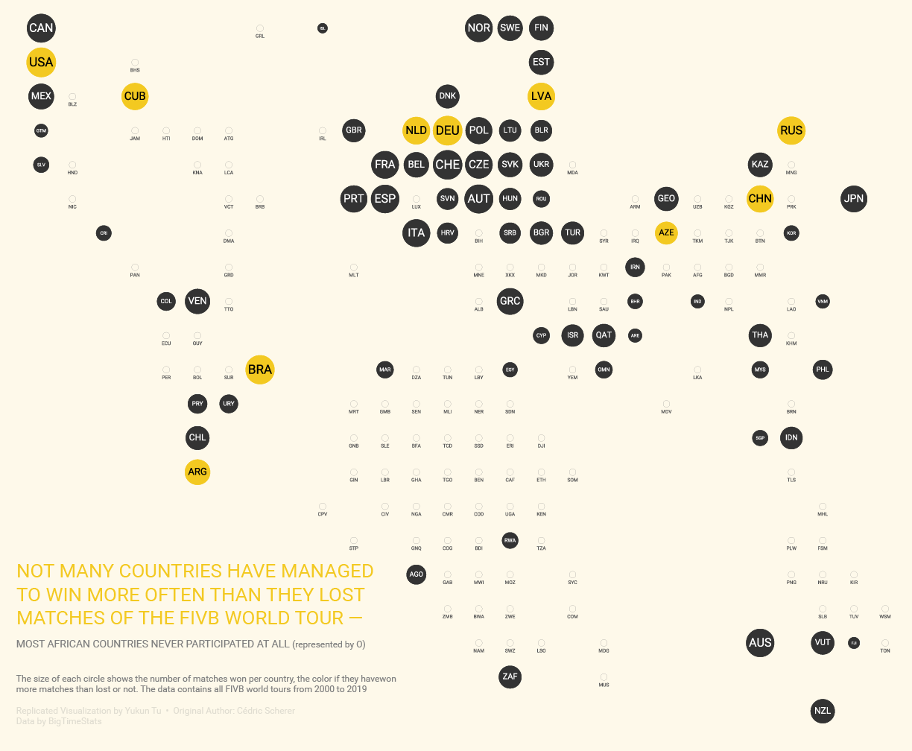
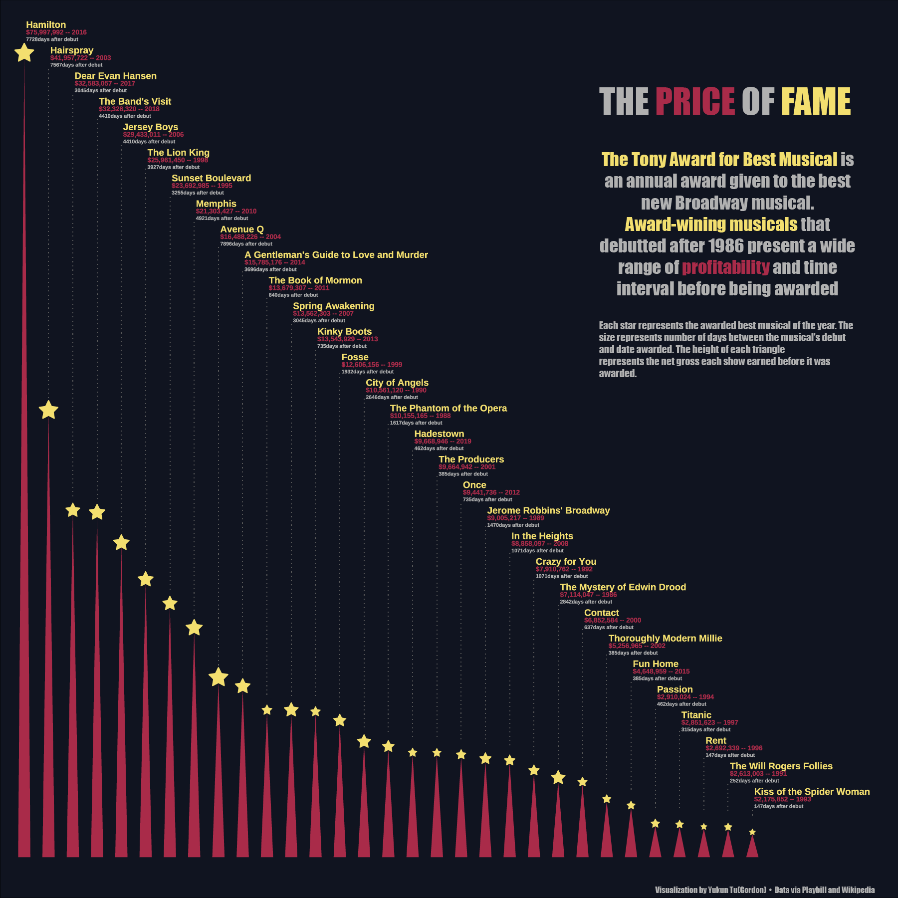
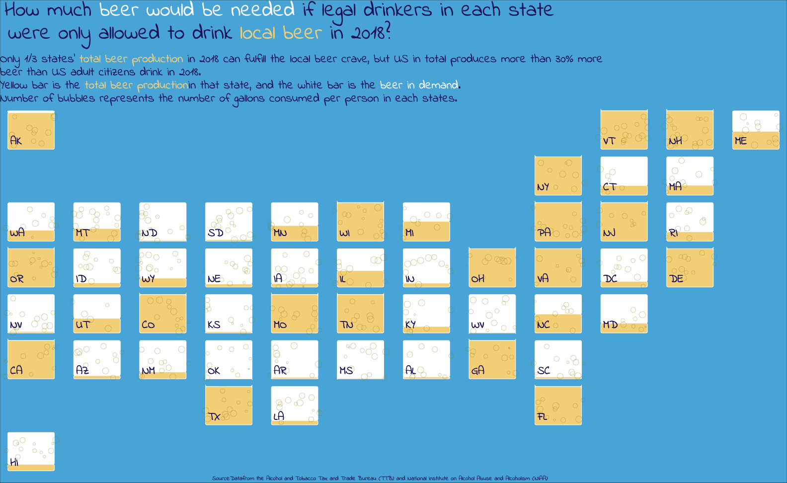

<h1 style="font-weight:normal" align="center">
  &nbsp;#TidyTuesday Contributions&nbsp;
</h1>

&nbsp;&nbsp;&nbsp;:link: [Blog][Blog]&nbsp;&nbsp;&nbsp;|&nbsp;&nbsp;&nbsp;:e-mail: [Email][Email]&nbsp;&nbsp;&nbsp;|&nbsp;&nbsp;&nbsp;:speech_balloon: [Twitter][Twitter]&nbsp;&nbsp;&nbsp;|&nbsp;&nbsp;&nbsp;:art: [Behance][Behance]&nbsp;&nbsp;&nbsp;|&nbsp;&nbsp;&nbsp;:necktie: [LinkedIn][LinkedIn]

[Twitter]:https://twitter.com/tu_yukun
[LinkedIn]:https://www.linkedin.com/in/yukun-tu-3886a2158/
[Email]:tugordon@outlook.com
[Blog]:https://tuyukun.com/post/
[Portfolio]:tuyukun.com

My contributions to the [#TidyTuesday challenge](https://github.com/rfordatascience/tidytuesday), a weekly social data project that focusses on understanding how to summarize and arrange data to make meaningful and/or beautiful charts with `{ggplot2}`, `{tidyr}`, `{dplyr}` and other tools that are part of the [`{tidyverse}`](https://www.tidyverse.org/) ecosystem. 

I will maintain (at least) a monthly contribution to sharpen my data viz skills in R and, more importantly, to learn from the fruitful R community.

### [2020-05-19](20200519_BeachVolleyball/replicate.Rmd) 🏐 Beach Volleyball by [BigTimeStats](https://bigtimestats.blog/data/)

***

### [2020-04-28](20200428_Broadway/submit.Rmd) 🎭️ Broadway Musicals by [Playbill](https://www.playbill.com/grosses)

***

### [2020-03-21](20200321_Beerproduction/Beer_states.Rmd) 🍺 Beer Production by [TTB](https://www.ttb.gov/beer/statistics)

***

